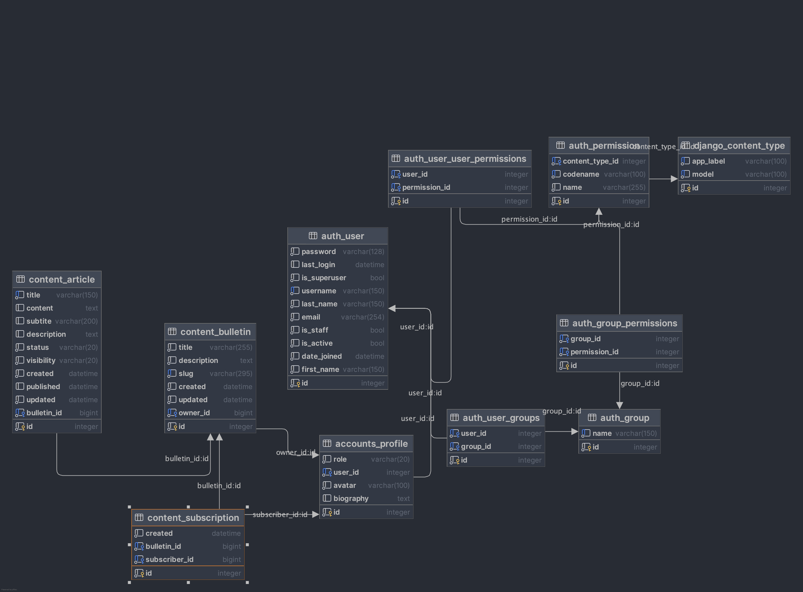

# Blog Platform

## Brief Description of Project
Django Blog Platform is a comprehensive content management system that enables readers to engage with articles, writers to publish and manage their content, and administrators to oversee site quality.

-----

## User Roles and Permissions
The system supports three distinct user roles, each with specific permissions:

### 0. Visitor (anyone who visits a website)
 - Access to all public articles that are visible to everyone.

### 1. Reader (user)
 - Personal profile where they can manage their information and subscription preferences.
 - Subscribe to writers to receive access to their private articles.
 - Ability to like and save articles + write comments under articles.

### 2. Writer
 - Inherits everything from Reader (every writer is a reader).
 - Beside personal profile, writer also possesses bulletin page with list of his published articles. 
 - Ability to create new articles and set their status (draft, public, private)
 - Ability to publish or hide (draft <-> public / private) his articles.
 - Ability to edit or delete his articles.

### 3. Administrator
 - Administrator evaluate and review articles of any reader on platform.
 - Ability to read all public and private articles regardless of subscription.
 - Ability to place articles under “evaluation” - making them hidden from readers (draft).
 - Articles under evaluation are either:
   - approved as safe or verified - making them visible again with also verified mark.
   - delete article as inappropriate - (send a warning to author of article)

### Possible Extensions
 - Reader could also report articles that they find troublesome.

 - There could be multiple writer plans based on number of articles that they can write and publish.
 - Writer's Dashboard - where he can manage his articles 
 - Writer's Bullerin - separate written content from profile. Should writer's profile be primary for his engagement with other people articles and writer's bulletin dedicated for writer's content presentation.

 - Administrator could send inappropriate article back to author, so author can rewrite or edit them.
 - If writer had multiple articles rejected, there could be warning mark for administrators to see on writer's profile.
 - In case of administrators, articles shouldn't be judged by one administrator only for deletion. 
 - Two types of administrators - basic managing articles, advanced managing also writers.
 - Should writers be put under evaluation also?

-----

## Database

- [ ] Article
  - [x] title (String)
  - [x] subtitle (String)
  - [ ] author (-> Profile)
  - [x] description (String)
  - [x] content (String)
  - [ ] image
  - [x] categories (n:m-> Category)
  - [ ] status (n:n -> Status)
  - [ ] bulletin (n:n -> Bulletin)
  - [x] created (DateTime)
  - [x] published (DateTime)
  - [x] updated (DateTime)

- [ ] Status
  - [ ] draft / published_public / published_private / evaluation (String?)

- [x] Category
  - [x] name (String)
  - [x] description (String)

- [ ] Like
  - [ ] author (-> User)
  - [ ] article (-> Article)
  - [ ] created (DateTime)

- [ ] ReadLater
  - [ ] author (-> User)
  - [ ] article (-> Article)
  - [ ] created (DateTime)

- [ ] Comment
  - [ ] author (-> User)
  - [ ] article (-> Article)
  - [ ] comment (String)
  - [ ] created (DateTime)
  - [ ] updated (DateTime)

### User Management

- [ ] User (default from Django)
  - [ ] username
  - [ ] first name
  - [ ] last name
  - [ ] password
  - [ ] email

- [ ] Profile
  - [ ] user (n:n-> User)
  - [ ] biography (String)
  - [ ] avatar (Image)
  - [ ] role () - options: reader, writer, admin
  - [ ] subscribed (n:m -> Bulletin)
  - [ ] created
  - [ ] updated

- [ ] Bulletin
  - [ ] title (String)
  - [ ] description (String)
  - [ ] author (n:n-> Profile)
  - [ ] articles (n:m -> Article)
  - [ ] created
  - [ ] updated

-----

## Functionalities

-----

### Forms
- register User
  - create Comment
- register Writer
  - create Bulletin
  - create Article (dashboard page)
- register Admin

## Platform Sitemap

- home page (most popular, recent articles)
- about page (description of platform for visitors)

- user profile (manage subscriptions, likes, read later)
- writer bulletin (list of articles)
- writer dashboard (create and manage articles)

-----
